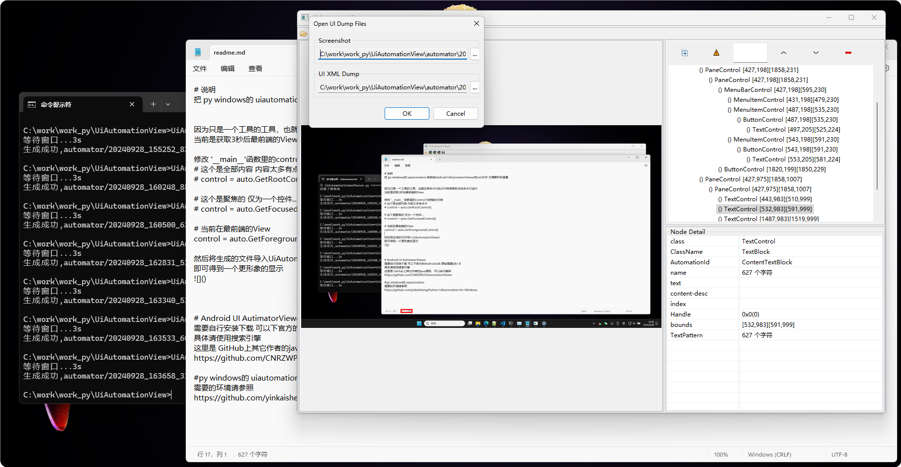

# 说明
把 py windows的 uiautomation 转换成Android UiAutomatorViewer的xml文件 方便解析和查看 

当前是获取3秒后最前端的View

然后将生成的文件导入UiAutomatorViewer 
即可得到一个更形象的显示

# 获取其它
因为只是一个工具的工具，也就没有命令行执行只有简单的点击命令行运行
修改 '__main__'函数里的control 切换输出内容
##### 这个是全部内容 内容太多有点卡
control = auto.GetRootControl()
##### 这个是聚焦的 仅为一个控件...
control = auto.GetFocusedControl()
##### 当前在最前端的View 当前默认
control = auto.GetForegroundControl()

# Android UI AutimatorViewer 
需要自行安装下载 可以下官方的Androidsdk 原始需要jdk1.8
具体请使用搜索引擎
这里是 GitHub上其它作者的java源码，可以自行编译
https://github.com/CNRZWP/UiAutomatorViewer

# py windows的 uiautomation  
脚本运行需要的环境请参照
https://github.com/yinkaisheng/Python-UIAutomation-for-Windows